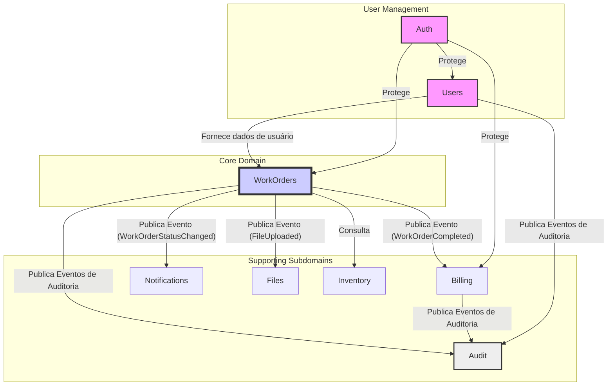

# Mapeamento de Contextos (Context Mapping)

Este documento define os Bounded Contexts do sistema Chronos, suas responsabilidades e as relações entre eles.

## 1. Bounded Contexts

A tabela abaixo detalha cada contexto delimitado do sistema.

| Contexto        | Responsabilidade                                        | Agregado Principal |
| --------------- | ------------------------------------------------------- | ------------------ |
| `auth`          | Autenticação e autorização via Keycloak.                | `UserSession`      |
| `users`         | Cadastro de usuários (Técnicos, Clientes, etc.).        | `User`             |
| `workorders`    | Gestão completa do ciclo de vida das ordens de serviço. | `WorkOrder`        |
| `billing`       | Gestão de contas, cobranças e pagamentos.               | `Account`          |
| `inventory`     | Controle de estoque de peças e equipamentos.            | `InventoryItem`    |
| `files`         | Upload e armazenamento de arquivos (via MinIO).         | `FileMetadata`     |
| `notifications` | Envio de notificações (e-mail, etc.).                   | `Notification`     |
| `audit`         | Trilha de auditoria de ações críticas no sistema.       | `AuditEvent`       |

---

## 2. Mapa de Contextos

O diagrama abaixo ilustra as relações de dependência entre os contextos.

**Relações:**

- **Users → WorkOrders (Customer/Supplier):** O contexto `WorkOrders` consome dados do contexto `Users` para saber quem são os técnicos e clientes.
- **WorkOrders → Billing (Published Language):** `WorkOrders` publica o evento `WorkOrderCompleted`, que contém os dados necessários para que `Billing` realize a cobrança.
- **WorkOrders → Notifications (Published Language):** `WorkOrders` publica eventos sobre mudanças de status, que são consumidos por `Notifications` para alertar os usuários.
- **WorkOrders → Files (Published Language):** `WorkOrders` publica eventos relacionados a arquivos, que são gerenciados pelo contexto `Files`.

---

## 3. Eventos de Integração Chave

Estes são os principais eventos que permitem a comunicação assíncrona entre os contextos.

- `WorkOrderCreated`
- `WorkOrderAssigned`
- `WorkOrderStarted`
- `WorkOrderCompleted`
- `InvoiceGenerated`
- `InvoicePaid`
- `FileUploaded`

Estes eventos serão implementados utilizando o Outbox Pattern para garantir a consistência.
